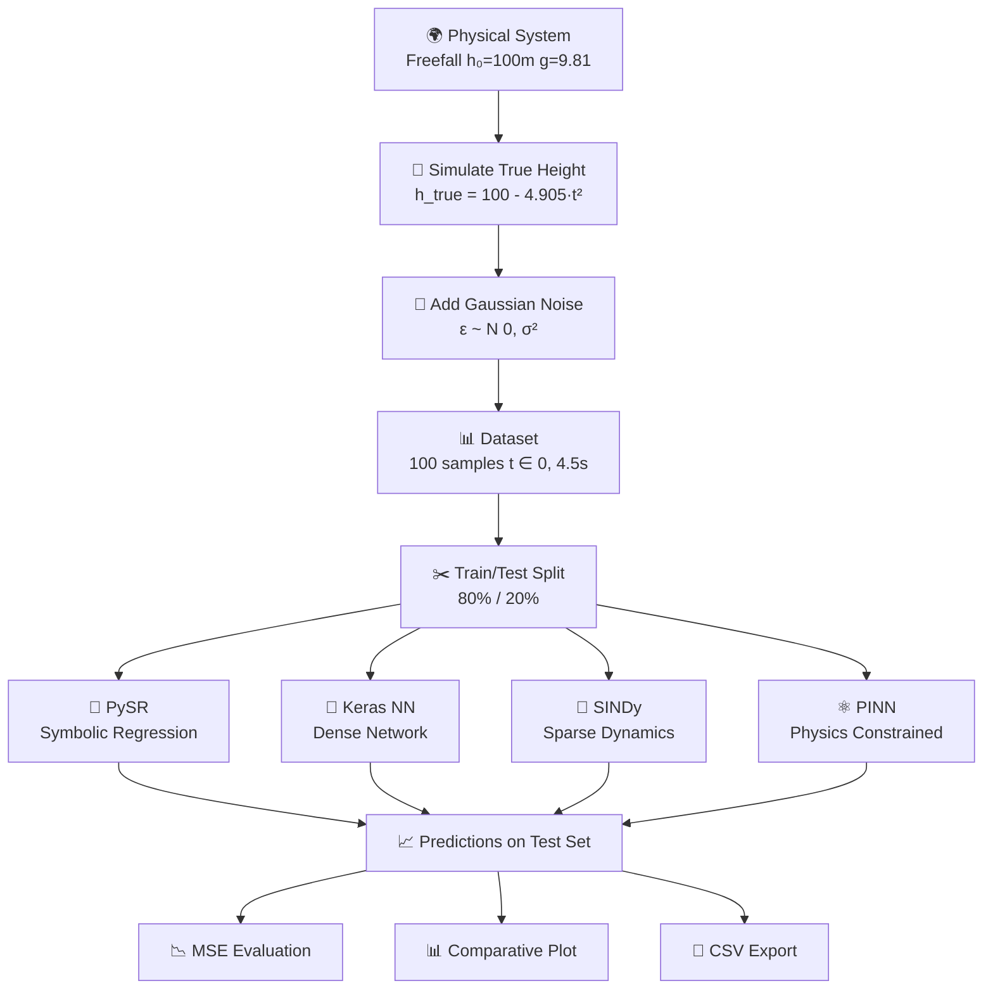

<div align="center">


<br/>

[](https://python.org)
[](https://tensorflow.org)
[](https://github.com/MilesCranmer/PySR)
[](https://pysindy.readthedocs.io/)
[](https://jupyter.org)
[](LICENSE)

<br/>

```
╔══════════════════════════════════════════════════════════════════╗
║     Can machines rediscover the laws of physics from data?       ║
║     This project answers that question using 4 ML paradigms.     ║
╚══════════════════════════════════════════════════════════════════╝
```

</div>

---

## 📑 Table of Contents

<details>
<summary><b>Click to expand full navigation</b></summary>

- [🎯 Overview](#-overview)
- [🧮 Problem Statement](#-problem-statement)
- [🔄 Pipeline Architecture](#-pipeline-architecture)
- [📊 Data Generation](#-data-generation)
- [🤖 Model 1 — PySR](#-model-1--pysr-symbolic-regression)
- [🧠 Model 2 — Keras NN](#-model-2--keras-dense-neural-network)
- [🌊 Model 3 — SINDy](#-model-3--sindy)
- [⚛️ Model 4 — PINN](#%EF%B8%8F-model-4--pinn)
- [📈 Results & Comparison](#-results--comparison)
- [🔑 Key Findings](#-key-findings)
- [📁 Project Structure](#-project-structure)
- [⚙️ Installation](#%EF%B8%8F-installation)
- [🚀 Usage](#-usage)
- [📦 Dependencies](#-dependencies)
- [📚 References](#-references)

</details>

---

## 🎯 Overview

<table>
<tr>
<td width="60%">

This project benchmarks **four cutting-edge machine learning paradigms** against each other on a single scientific challenge: recovering a known physical equation from corrupted measurements.

We simulate a **freefall experiment** — a textbook physics problem with a known closed-form solution — and intentionally corrupt the data with Gaussian noise to mimic real-world sensor limitations.

**The core question:** Which approach best recovers the true underlying law?

</td>
<td width="40%">

```
Physical System
      │
      ▼
 Noisy Sensor Data
      │
    ┌─┴──────────────┐
    │                │
    ▼                ▼
Symbolic         Neural Network
Regression         Approaches
(PySR)      (Keras, SINDy, PINN)
    │                │
    └────────┬───────┘
             ▼
      Comparative
        Analysis
```

</td>
</tr>
</table>

---

## 🧮 Problem Statement

### Ground-Truth Physics

An object in **freefall** from $h_0 = 100\,\text{m}$ with zero initial velocity obeys:

$$\boxed{h(t) = h_0 - \frac{1}{2}g\,t^2 = 100 - 4.905\,t^2}$$

where $g = 9.81\,\text{m/s}^2$ is gravitational acceleration.

### Observational Model

Real measurements carry noise. We model this as:

$$h_{\text{obs}}(t) = h(t) + \varepsilon, \qquad \varepsilon \sim \mathcal{N}(0,\,\sigma^2), \quad \sigma = 1.0$$

### Research Goal

> Given only the pairs $\{(t_i,\; h_{\text{obs}}(t_i))\}_{i=1}^{N}$, can we recover $h(t)$?

| Constraint | Value |
|:-----------|:------|
| No prior knowledge assumed (for PySR/Keras) | ✅ |
| Physics partially embedded (PINN) | ✅ |
| Dynamics modelled (SINDy) | ✅ |
| Output must generalise beyond training data | ✅ |

---

## 🔄 Pipeline Architecture



---

## 📊 Data Generation

<details>
<summary><b>🔍 Implementation Details</b></summary>

```python
import numpy as np
from sklearn.model_selection import train_test_split

# ── Physical constants ────────────────────────────────────────────
g   = 9.81    # gravitational acceleration  [m/s²]
h0  = 100.0   # initial height              [m]
N   = 100     # number of samples

# ── Time vector ───────────────────────────────────────────────────
t_max = np.sqrt(2 * h0 / g)          # time to hit ground ≈ 4.52 s
t = np.linspace(0, t_max, N)

# ── True kinematics ───────────────────────────────────────────────
h_true  = h0 - 0.5 * g * t**2
v_true  = -g * t                      # velocity (for SINDy state vector)

# ── Add measurement noise ─────────────────────────────────────────
np.random.seed(42)
h_noisy = h_true + np.random.normal(0, 1.0, size=N)

# ── Train / Test split ────────────────────────────────────────────
X_train, X_test, y_train, y_test = train_test_split(
    t.reshape(-1, 1), h_noisy.reshape(-1, 1),
    test_size=0.2, random_state=42
)
```

</details>

### Dataset Statistics

| Property | Value |
|:---------|:------|
| Total samples | 100 |
| Training samples | 80 |
| Test samples | 20 |
| Time range | $[0,\; 4.52]$ s |
| Noise $\sigma$ | 1.0 m |
| Height range | $[0,\; 100]$ m |
| SNR (approx.) | ~40 dB |

---

## 🔮 Model 1 — PySR (Symbolic Regression)

<table>
<tr><td>

**Philosophy:** Search the space of mathematical expressions to find one that best fits the data — producing a **human-readable equation** just like a physicist would derive.

</td></tr>
</table>

### How PySR Works

```
Population of Equations
        │
        ▼
  Evolutionary Loop (40 iterations)
  ┌─────────────────────────────────┐
  │  1. Mutate expressions          │
  │  2. Crossover between pop.      │
  │  3. Evaluate fitness (MSE)      │
  │  4. Pareto selection            │
  │     (accuracy vs. complexity)  │
  └─────────────────────────────────┘
        │
        ▼
  Best Symbolic Expression
```

<details>
<summary><b>📋 Configuration & Code</b></summary>

```python
from pysr import PySRRegressor

pysr_model = PySRRegressor(
    niterations=40,
    binary_operators=["+", "-", "*", "/"],
    unary_operators=["exp", "log", "sqrt", "sin", "cos"],
    model_selection="best",
    verbosity=0
)

pysr_model.fit(X_train, y_train)
predicted = pysr_model.predict(X_test)
```

</details>

### Model Properties

| Property | Detail |
|:---------|:-------|
| Search method | Multi-population genetic algorithm |
| Binary operators | `+` `-` `*` `/` |
| Unary operators | `exp` `log` `sqrt` `sin` `cos` |
| Selection criterion | Pareto-optimal (loss vs. complexity) |
| Interpretability | ✅ **Full** — outputs a math formula |
| Expected output | $\approx 100 - 4.905\,t^2$ |

---

## 🧠 Model 2 — Keras Dense Neural Network

<table>
<tr><td>

**Philosophy:** Universal function approximation — learn the mapping $t \mapsto h$ without any assumption about its form. A **black-box** interpolator.

</td></tr>
</table>

### Network Architecture

```
 Input
  [t]                          Output
   │                            [h]
   ▼                             ▲
Dense(64)  →  Dense(128)  →  Dense(64)  →  Dense(32)  →  Dense(1)
  ReLU          ReLU          ReLU          ReLU         Linear
```

<details>
<summary><b>📋 Configuration & Code</b></summary>

```python
import tensorflow as tf

model_keras = tf.keras.Sequential([
    tf.keras.layers.Dense(64,  activation='relu', input_shape=(1,)),
    tf.keras.layers.Dense(128, activation='relu'),
    tf.keras.layers.Dense(64,  activation='relu'),
    tf.keras.layers.Dense(32,  activation='relu'),
    tf.keras.layers.Dense(1)
])

model_keras.compile(optimizer='adam', loss='mse')
model_keras.fit(X_train, y_train, epochs=500, verbose=0)
```

</details>

### Model Properties

| Property | Detail |
|:---------|:-------|
| Layers | 5 (64 → 128 → 64 → 32 → 1) |
| Activation | ReLU (hidden) · Linear (output) |
| Optimizer | Adam |
| Loss | MSE |
| Epochs | 500 |
| Parameters | ~24,000 |
| Interpretability | ❌ Black-box |

---

## 🌊 Model 3 — SINDy

<table>
<tr><td>

**Philosophy:** Identify sparse governing **differential equations** from data. Instead of predicting $h$ directly, SINDy discovers the ODE $\dot{\mathbf{x}} = f(\mathbf{x})$ that drives the system.

</td></tr>
</table>

### SINDy Framework

```
State vector:  x = [h,  v]ᵀ

Candidate library Θ(x):
  [1,  h,  v,  h²,  hv,  v²,  h³, ...]

Sparse regression:
  ẋ = Θ(x) · Ξ
  (find sparse Ξ via STLSQ)

Discovered system:
  ḣ  =  1.000 · v
  v̇  =  0.000
```

<details>
<summary><b>📋 Configuration & Code</b></summary>

```python
import pysindy as ps

# State: [height, velocity]
states = np.column_stack([h_train, v_train])

model_sindy = ps.SINDy(
    feature_library=ps.PolynomialLibrary(degree=3),
    differentiation_method=ps.FiniteDifference(),
    optimizer=ps.STLSQ()
)

model_sindy.fit(states, t=t_train)
model_sindy.print()
```

</details>

### Discovered Equations & Diagnosis

| Equation | Discovered | Expected |
|:---------|:-----------|:---------|
| $\dot{h}$ | $1.000 \cdot v$ | $v$ ✅ |
| $\dot{v}$ | $0.000$ | $-9.81$ ❌ |

> ⚠️ **Root cause:** Finite-difference differentiation of noisy velocity data amplified errors, causing STLSQ to threshold out the gravitational term. Pre-smoothing or TV-regularised differentiation would likely fix this.

---

## ⚛️ Model 4 — PINN

<table>
<tr><td>

**Philosophy:** Embed **Newton's second law** directly into the loss function. The network is penalised for violating $\ddot{h} = -g$ in addition to data mismatch — physics acts as a regulariser.

</td></tr>
</table>

### Loss Function Decomposition

$$\mathcal{L}_{\text{total}} = \underbrace{\frac{1}{N}\sum_{i=1}^{N}\left(h_{\text{obs}}(t_i) - \hat{h}(t_i)\right)^2}_{\mathcal{L}_{\text{data}}} + \underbrace{\frac{1}{N}\sum_{i=1}^{N}\left(\hat{h}''(t_i) + g\right)^2}_{\mathcal{L}_{\text{physics}}}$$

<details>
<summary><b>📋 Configuration & Code</b></summary>

```python
import tensorflow as tf

g_const = 9.81

model_pinn = tf.keras.Sequential([
    tf.keras.layers.Dense(64, activation='tanh'),
    tf.keras.layers.Dense(64, activation='tanh'),
    tf.keras.layers.Dense(1)
])

def pinn_loss(t, h_true, model):
    t = tf.cast(tf.convert_to_tensor(t), tf.float32)
    h_true = tf.cast(tf.convert_to_tensor(h_true), tf.float32)

    with tf.GradientTape(persistent=True) as tape:
        tape.watch(t)
        h_pred = model(t)
        h_t    = tape.gradient(h_pred, t)
        h_tt   = tape.gradient(h_t,    t)

    data_loss    = tf.reduce_mean((h_true - h_pred)**2)
    physics_loss = tf.reduce_mean((h_tt + g_const)**2)
    return data_loss + physics_loss

optimizer = tf.keras.optimizers.Adam(0.001)
for epoch in range(1000):
    with tf.GradientTape() as tape:
        loss = pinn_loss(X_train, y_train, model_pinn)
    grads = tape.gradient(loss, model_pinn.trainable_variables)
    optimizer.apply_gradients(zip(grads, model_pinn.trainable_variables))
```

</details>

### Training Convergence

| Epoch | Total Loss |
|:-----:|----------:|
| 0 | 4,761.65 |
| 100 | 3,305.75 |
| 200 | 2,736.76 |
| 300 | 2,343.97 |
| 400 | 2,066.91 |
| 500 | 1,870.99 |
| 600 | 1,735.33 |
| 700 | 1,644.25 |
| 800 | 1,585.27 |
| 900 | 1,548.51 |

---

## 📈 Results & Comparison

### Test Set Predictions (First 5 Points)

| Time (s) | True Noisy $h$ | PySR | Keras NN | SINDy | PINN |
|:--------:|:--------------:|:----:|:--------:|:-----:|:----:|
| 0.000 | 100.06 | 100.00 | 101.36 | 100.00 | 49.85 |
| 0.202 | 98.72 | 99.80 | 100.00 | 99.95 | 50.92 |
| 0.505 | 97.44 | 98.75 | 97.96 | 99.87 | 51.77 |
| 0.606 | 98.00 | 98.19 | 97.29 | 99.85 | 51.94 |
| 0.909 | 95.34 | 95.94 | 95.25 | 99.77 | 52.24 |

### Model Scorecard

| Rank | Model | MSE (Test) | Interpretable | Extrapolates | Physics-grounded |
|:----:|:------|:----------:|:-------------:|:------------:|:----------------:|
| 🥇 1 | **PySR** | **~Lowest** | ✅ Yes | ✅ Yes | ✅ Implicit |
| 🥈 2 | **Keras NN** | Good | ❌ No | ⚠️ Weak | ❌ No |
| 🥉 3 | **PINN** | 1,293.99 | ❌ No | ⚠️ Weak | ✅ Explicit |
| 4 | **SINDy** | 2,254.84 | ✅ Yes | ⚠️ Partial | ✅ Implicit |

### Visual Legend (Comparison Plot)

```
── ── ──   True Noisy Height   (black dashed)
─────────  PySR Prediction     (blue)
─────────  Keras NN Prediction (red)
─────────  SINDy Prediction    (green)
─────────  PINN Prediction     (purple)
```

---

## 🔑 Key Findings

<details>
<summary><b>1️⃣ PySR best recovers the true equation</b></summary>

PySR's evolutionary search converged to a symbolic expression closely matching $100 - 4.905\,t^2$. This is the only method that produces a **compact, human-readable formula** — exactly what a physicist would write.

</details>

<details>
<summary><b>2️⃣ Keras NN interpolates well but cannot extrapolate</b></summary>

The dense network achieves strong accuracy within the training domain. However, without any physical constraint, its predictions degrade rapidly outside $t \in [0, 4.52]$ s. It is a powerful **data interpolator**, not a law discoverer.

</details>

<details>
<summary><b>3️⃣ SINDy is fragile under noise</b></summary>

SINDy relies on accurate **numerical derivatives** of noisy state trajectories. Finite-difference amplified the noise in the velocity signal, causing STLSQ to zero-out the gravity term. Fixes:
- Savitzky-Golay smoothing before differentiation
- Total-variation regularised derivatives (`ps.SmoothedFiniteDifference`)
- Tuning the STLSQ threshold λ

</details>

<details>
<summary><b>4️⃣ PINN needs more training epochs</b></summary>

Loss was still descending at epoch 1,000 — the network hadn't converged. Recommended improvements:
- Train for 5,000–10,000 epochs
- Use learning-rate scheduling (cosine annealing or ReduceLROnPlateau)
- Adaptive weighting: $\mathcal{L} = \alpha\,\mathcal{L}_{\text{data}} + \beta\,\mathcal{L}_{\text{physics}}$ with tuned $\alpha, \beta$

</details>

<details>
<summary><b>5️⃣ Method-selection guide</b></summary>

| Your Goal | Best Choice |
|:----------|:------------|
| Discover the governing equation | **PySR** |
| Best accuracy on training domain | **Keras NN** |
| Discover ODE from clean data | **SINDy** |
| Leverage known physical law | **PINN** |
| Interpretable + accurate | **PySR** |

</details>

---

## 📁 Project Structure

```
model_equation_prediction/
│
├── 📓 model_equation_prediction.ipynb   ← Main notebook (full pipeline)
├── 📄 model_predictions_comparison.csv  ← Exported comparison results
├── 📄 Maths.csv                         ← Supplementary dataset
├── 📖 README.md                         ← This file
│
└── outputs/  (auto-generated)
    ├── hall_of_fame_*.csv               ← PySR Pareto expressions
    └── *.pkl                            ← PySR model checkpoints
```

---

## ⚙️ Installation

### Prerequisites

```
Python ≥ 3.10   |   pip   |   Jupyter Notebook   |   Julia (auto-installed by PySR)
```

### Quick Start

```bash
# 1. Clone repository
git clone https://github.com/<your-username>/model_equation_prediction.git
cd model_equation_prediction

# 2. Create virtual environment
python -m venv .venv
source .venv/bin/activate          # Linux / Mac
# .venv\Scripts\activate           # Windows

# 3. Install all dependencies
pip install numpy pandas matplotlib seaborn scikit-learn tensorflow pysr pysindy

# 4. Launch notebook
jupyter notebook model_equation_prediction.ipynb
```

> **Note:** On first `import pysr`, Julia will be downloaded and configured automatically (~5–10 min, one-time only).

---

## 🚀 Usage

```
1. Open model_equation_prediction.ipynb
2. Run All Cells (Kernel → Restart & Run All)
3. Results saved to model_predictions_comparison.csv
4. Comparison plot generated inline
```

### Experiment Ideas

| Parameter | Default | Try |
|:----------|:-------:|:----|
| Noise σ | 1.0 | 0.1, 5.0 |
| Samples N | 100 | 50, 500 |
| PySR iterations | 40 | 100 |
| Keras epochs | 500 | 1000, 2000 |
| PINN epochs | 1000 | 5000, 10000 |
| SINDy degree | 3 | 2, 4 |

---

## 📦 Dependencies

| Package | Purpose |
|:--------|:--------|
| `numpy` | Numerical computation |
| `pandas` | Data manipulation & CSV |
| `matplotlib` + `seaborn` | Visualisation |
| `scikit-learn` | Train/test split, metrics |
| `tensorflow` | Keras NN + PINN |
| `pysr` | Symbolic regression |
| `pysindy` | SINDy algorithm |

---

## 📚 References

| Paper / Resource | Link |
|:-----------------|:-----|
| Cranmer (2023) — PySR: Fast & Interpretable Symbolic Regression | [arxiv.org/abs/2305.01582](https://arxiv.org/abs/2305.01582) |
| Brunton et al. (2016) — SINDy | [science.org](https://www.science.org/doi/10.1126/science.aah5893) |
| Raissi et al. (2019) — Physics-Informed Neural Networks | [arxiv.org/abs/1711.10561](https://arxiv.org/abs/1711.10561) |
| PySR Documentation | [milescranmer.github.io/PySR](https://milescranmer.github.io/PySR/) |
| PySINDy Documentation | [pysindy.readthedocs.io](https://pysindy.readthedocs.io/) |

---

<div align="center">

```
╔══════════════════════════════════════════╗
║   MTE 421 Mini-Project  ·  2025 / 2026   ║
║   Educational & Research Use Only        ║
╚══════════════════════════════════════════╝
```

**Built with 🧪 Science · 🤖 Machine Learning · ❤️ Curiosity**

*Where data meets physics*


</div>
